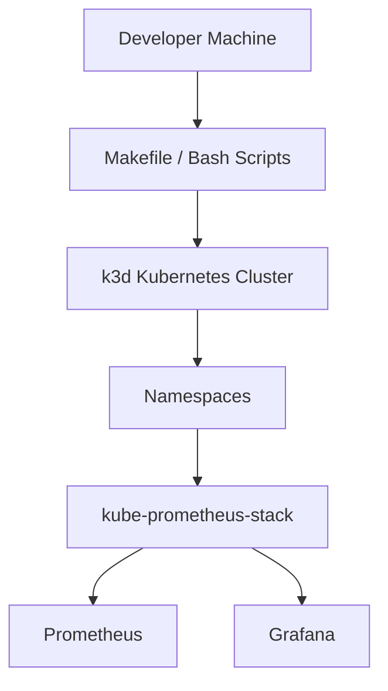
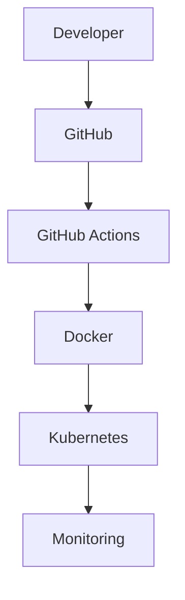

<div align="center">

# SentinelAI Platform

**A local-first Kubernetes automation platform for DevOps and Platform Engineering.**


[](https://github.com/Heyyprakhar1/sentinel-ai-platform/actions/workflows/ci.yml)


</div>

SentinelAI Platform automates local Kubernetes infrastructure setup with a single command. It provisions a k3d cluster, configures namespaces, and deploys a full monitoring stack — and serves as the foundation for GitOps, cloud deployment, and AI-powered operations as the project grows.

The current focus is local Kubernetes automation using k3d.

---

## Why SentinelAI?

Most Kubernetes tutorials stop at `kubectl apply` on a single pod. Real platform work is mostly the repeatable, unglamorous parts underneath that: installing the right tools, creating a cluster the same way every time, wiring up namespaces, and getting monitoring running before anything else touches the cluster.

SentinelAI Platform automates that foundation, end to end, using the same structure a platform team would: a discoverable Makefile interface, modular bash scripts, and a health check you can run at any time.

---

## Features

- Automated installation of Docker, kubectl, Helm, and k3d
- One-command k3d cluster creation
- Automated kubeconfig export and cluster discovery
- Docker network configuration for the cluster
- Automated namespace creation
- Monitoring stack deployment (`kube-prometheus-stack`)
- Platform health diagnostics (`make doctor`)
- One-command platform setup and teardown
- Makefile-driven command interface
- Continuous Integration via GitHub Actions

---

## Architecture



---

## Repository Structure

```
sentinel-ai-platform/
├── Makefile
├── docker-compose.yml
├── Dockerfile
├── requirements.txt
├── scripts/
│   ├── install/        # Docker, kubectl, Helm, k3d installers
│   ├── cluster/         # Cluster creation, kubeconfig, discovery, network
│   ├── deploy/           # Namespaces, monitoring, ArgoCD
│   ├── health/            # Platform Doctor
│   ├── utils/              # Shared shell helpers
│   ├── setup.sh             # One-command bootstrap
│   └── teardown.sh          # One-command teardown
├── monitoring/
│   ├── kubernetes/          # kube-prometheus-stack Helm values
│   └── compose/              # Docker Compose monitoring config
├── k8s/
│   ├── base/                  # Core application manifests
│   ├── overlays/                # dev / staging / prod
│   ├── argocd/                   # GitOps ApplicationSet
│   └── gatekeeper/                # OPA admission policies
├── argocd/
│   └── helm/                       # ArgoCD Helm values
├── terraform/                       # AWS EKS infrastructure
├── app/                              # FastAPI backend
├── ai/                                # AI engine
├── frontend/                          # React dashboard
├── docs/                               # Architecture & setup notes
├── tests/                              # Test suite
└── README.md
```

---

## Installation

| Tool | Required |
|---|---|
| Docker | Yes |
| kubectl | Yes |
| Helm | Yes |
| k3d | Yes |
| Git | Yes |

Docker, kubectl, Helm, and k3d are installed automatically by the setup script if they aren't already present.

---

## Local Setup

**Method 1**

```bash
make setup
```

**Method 2**

```bash
bash scripts/setup.sh
```

### What happens during setup

1. Installs Docker, kubectl, Helm, and k3d (skipped if already installed)
2. Detects the environment and checks for conflicting clusters
3. Creates the k3d cluster
4. Exports the kubeconfig
5. Discovers and verifies the cluster
6. Configures the Docker network
7. Creates namespaces (`argocd`, `monitoring`, `sentinelai-dev`, `sentinelai-staging`, `sentinelai-prod`)
8. Deploys the monitoring stack (`kube-prometheus-stack`)
9. Runs the Platform Doctor health check

ArgoCD deployment is intentionally skipped by default during setup.

---

## Verify Installation

```bash
make doctor
kubectl get nodes
kubectl get pods -A
helm list -A
```

---

## Platform Commands

| Command | Description |
|---|---|
| `make help` | List all available commands |
| `make install` | Install Docker, kubectl, Helm, and k3d |
| `make cluster` | Create and configure the k3d cluster |
| `make deploy` | Create namespaces and deploy monitoring |
| `make monitoring` | Deploy the Prometheus + Grafana stack |
| `make argocd` | Deploy ArgoCD (manual, opt-in) |
| `make doctor` | Run the platform health check |
| `make setup` | Run the full bootstrap end-to-end |
| `make teardown` | Remove the entire platform |

---

## Cloud Deployment

Local automation through `make setup` is fully supported and is the primary way to run this platform today.

The repository also includes a Terraform configuration for AWS EKS (VPC, EKS cluster, IAM, ECR) under `terraform/`, and ArgoCD manifests under `k8s/argocd/` for GitOps-based delivery. Neither is wired into the local setup flow yet. Both can be run manually:

```bash
cd terraform
terraform init
terraform plan
```

Cloud deployment is currently under development and is not part of the automated setup.

---

## GitHub Actions

Two workflows run automatically on every push and pull request to `main`:

- **CI Pipeline** — runs the test suite with coverage, a SonarCloud code quality scan, and a Docker build with a Trivy vulnerability scan
- **Security Checks** — runs Bandit and pip-audit against the Python codebase, plus a dependency check on the frontend



Today, GitHub Actions covers testing, code quality, and image build/scan. Kubernetes deployment and monitoring setup still happen locally through the Makefile — they are not yet triggered by CI.

---

## Roadmap

### ✅ Completed

- Docker, kubectl, Helm, and k3d installation automation
- Cluster creation, kubeconfig export, and cluster discovery
- Docker network configuration
- Namespace creation
- Monitoring stack deployment (`kube-prometheus-stack`)
- Platform health diagnostics (`make doctor`)
- One-command platform setup and teardown
- Makefile automation
- GitHub Actions CI

### 🚧 In Progress

- ArgoCD GitOps — manifests are ready, deployment is intentionally disabled for now
- Terraform / AWS EKS — present in the repository, not yet integrated into automated setup
- AI engine — exists in the repository, not yet part of the platform bootstrap

### 🔜 Planned

- Wiring ArgoCD into the automated setup flow
- Integrating Terraform-based cloud provisioning into the Makefile
- Connecting the AI engine into the platform once the GitOps and cloud paths are stable
- Extending CI/CD to include automated deployment

---

## Contributing

Contributions are welcome.

1. Fork the repository
2. Create a feature branch: `git checkout -b feature/your-feature`
3. Commit your changes
4. Open a pull request

Run `make doctor` before submitting a pull request to confirm your environment is healthy.

---

## License

Licensed under the [MIT License](LICENSE).
